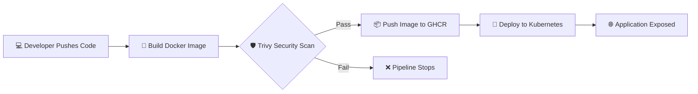

# 🛡️ DevSecOps Automation Pipeline  
### Secure CI/CD with GitHub Actions, Trivy & Kubernetes (Minikube)


---

## 📖 Project Overview

This repository demonstrates a **complete DevSecOps automation pipeline** developed as part of an **Advanced Cloud Computing course**.

The project automates the entire lifecycle of a **Node.js application** — from source code commit to secure deployment — while enforcing **security at every stage** using a **Shift-Left DevSecOps approach**.

The pipeline runs on a **Self-Hosted GitHub Actions Runner** and deploys the application to a **local Kubernetes cluster (Minikube)**.

---

## 🎯 What We Achieved

✔ Fully automated CI/CD pipeline  
✔ Integrated security scanning (DevSecOps)  
✔ Containerized application delivery  
✔ Kubernetes-based deployment  
✔ Real-world cloud-native workflow

---

## 🏗️ Architecture & Workflow



---

## 🔄 Pipeline Stages Explained

1. **Source Code Commit**  
   Developer pushes code to GitHub.

2. **Semantic Versioning**  
   Automatically generates version tags (e.g. `v1.0.1`) based on commit history.

3. **Docker Image Build**  
   Builds a lightweight and optimized container image.

4. **Security Scanning (Trivy)**  
   - Scans image for **CRITICAL** and **HIGH** vulnerabilities  
   - Pipeline **fails immediately** if vulnerabilities are detected

5. **Image Registry (GHCR)**  
   Securely pushes verified images to **GitHub Container Registry**.

6. **Kubernetes Deployment**  
   Performs rolling updates on **Minikube** using Kubernetes manifests.

---

## 🛠️ Technology Stack

| Layer | Technology | Purpose |
|------|-----------|--------|
| Source Control | GitHub | Version control & collaboration |
| CI/CD | GitHub Actions | Automated pipeline |
| Containerization | Docker | Application packaging |
| Registry | GHCR | Secure image storage |
| Orchestration | Kubernetes (Minikube) | Container deployment |
| Security | Trivy | Vulnerability scanning |
| Backend | Node.js + Express | Application logic |
| Runner | Self-Hosted Runner | Full environment control |

---

## 🚀 Getting Started

### ✅ Prerequisites

Ensure the following tools are installed:

- Docker  
- Minikube  
- kubectl  
- Git

---

### 📥 Installation

```bash
# Clone the repository
git clone https://github.com/RoshaneAnees/devsecops.git
cd devsecops

# Start Minikube
minikube start --driver=docker

# Verify cluster
kubectl get nodes
```

---

### 🚢 Deployment

Deployment is **fully automated** via GitHub Actions.

For manual testing:

```bash
kubectl apply -f k8s/
```

---

## 🔒 Security Implementation (DevSecOps Core)

Security is **embedded**, not optional.

- 🔍 **Scanner:** Trivy (Aqua Security)
- 🎯 **Target:** Docker image
- 🚨 **Severity Gate:** CRITICAL & HIGH
- ⛔ **Policy:** Pipeline stops on detection

This ensures **no vulnerable container reaches production**.

---

## 🌐 Accessing the Application

### Check Pod Status

```bash
kubectl get pods
```

### Access via Minikube

```bash
minikube service devsecops-svc --url
```

### Port Forward (Alternative)

```bash
kubectl port-forward svc/devsecops-svc 3000:3000
```

Visit:  
👉 **http://localhost:3000**

---

## 📂 Repository Structure

```text
devsecops/
├── .github/workflows/
│   └── cicd.yaml        # ⚙️ CI/CD Pipeline
├── app/
│   ├── Dockerfile       # 🐳 Docker image definition
│   ├── package.json     # 📦 Dependencies
│   └── index.js         # ⚡ Application entry point
├── k8s/
│   ├── deployment.yaml  # ☸️ Kubernetes deployment
│   └── service.yaml     # 🌐 Service exposure
└── README.md            # 📄 Documentation
```

---

## 🌍 Real-World & Cloud Computing Relevance

This project directly maps to **industry-grade cloud practices**:

- Mirrors **enterprise DevSecOps pipelines**
- Implements **container security gates**
- Uses **cloud-native orchestration**
- Demonstrates **CI/CD + Kubernetes integration**
- Applies **Shift-Left security principles**

---

## 🧠 Why This Project Matters

Traditional DevOps focuses on speed.  
**DevSecOps adds trust, safety, and compliance.**

This project proves:
- Security can be **automated**
- CI/CD can be **secure by design**
- Cloud deployments can be **reliable & scalable**

---

## 👨‍💻 Author

<div align="center">

### **Roshane Anees**  
**DevSecOps Automation Project**  
*Advanced Cloud Computing • Fall 2026*

</div>

---

⭐ If you found this project useful, consider starring the repository!

